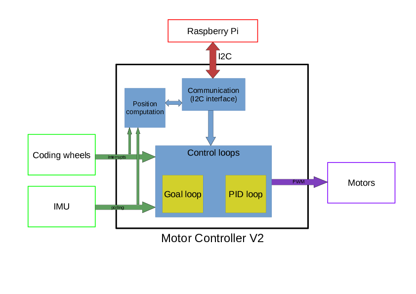

# Overview
This repository contains the code for the MotorController board, developped
by Telecom Robotics. This board is part of the [robot-framework](https://github.com/TelecomParistoc/robot-framework) currently developped by the association. It can also be used independantly from this framework.
This board, and the associated code, are in charge of handling all low-level tasks
related to robot moves: motor control, data acquisition from various sensors
(IMU and coding wheels for now), current position computation and so on.

Below, you'll find the general documentation for the various components of this project. More detailed documentation is available [here](https://telecomparistoc.github.io/MotorController/)

# Download
In order to get a working copy of this code, you have to follow some steps in
addition to simply clone this repo. Indeed, some generic drivers (the IMU driver
for now) are included as a submodule.
The interest of submodules is that they allow you to always get the most up-to-date
version of a project developped in an independant repository. And keeping repository
focused on a single project appears to us as a good practice: one repository for one project.

Run the following commands in a terminal to get a fully usable copy of this project:
- clone the repository
- cd in the directory of the repo
- ```$ git submodule init```
- ```$ git submodule update```

At any time when using this repo, if you want to obtain the latest updates of the generic
drivers, you can use ```$ git submodule update --remote```.

# Compilation & flash
The same code is used for both robots. Data which are specific to each robot (PID
coeffs, motor configuration, ...) are stored in flash and loaded when the program
starts.
Simply run ```$ make``` to compile the code.
List of *make* targets available:
  - **all**: compile the code
  - **clean**: delete all files produced by the compilation process
  - **debugserver**: launch JLinkGDBServer and waits for a GDB connection
  - **gdb**: start gdb with the binary file of the project

To flash a board, follow these steps:
  - connect the SEGGER probe to the board with the SWD cable and to your computer
     with the USB cable.
  - power up the board
  - go the parent directory of this repository (the one containing the Makefile)
  - run ```$ make``` in a terminal
  - run ```$ make debugserver```
  - open a new terminal
  - run ```$ make gdb``` in this new terminal

To see the printf output, you need JLinkRTTClient. You should already have it (it
comes with JLinkGDBServer).
In another terminal, run ```$ JLinkRTTClient```.

Note: If you don't have JLinkGDBServer, you can download it [here](https://www.segger.com/downloads/jlink-beta/)
(choose *J-Link Software and Documentation Pack*).

# Description

The picture below shows the general architecture of this software component:


This project uses ChibiOS as its operating system. For a complete description of
this OS, go the dedicated [website](http://www.chibios.org/dokuwiki/doku.php).

## Communication
This component is in charge of the communication between the central unit of the
robot (a Raspberry Pi in the actual implementation) and the motorboard.
It acts as an I2C slave, providing an interface that looks like memory-mapped registers.
For the descriptions of this interface, see the file [specs.md](./specs.md).

It's composed of 2 files:
   - *i2c_interface.h*
   - *i2c_interface.c*


## Coding wheels
This component is responsible of handling the coding wheels inputs. It's basically
an interrupt handler.
It's composed of 2 files:
   - *coding_wheels.h*
   - *coding_wheels.c*

To initialize this driver, call the ```init_coding_wheels()``` function. As
parameter, pass a `coding_wheels_config_t` object. This object must contain the
following information:
   - initial value of each counter (right wheel and left wheel)
   - orientation of each wheel (DIRECT or INDIRECT). This parameter allows the user
     to decide which rotation sense corresponds to a forward movement and thus to
     an increase of the associated counter).

**Note**: It's necessary to enable the ChibiOS EXT driver by setting `HAL_USE_EXT` to
`TRUE` in *halconf.h*

This driver then displays two counters (one for each coding wheel): `right_ticks`
& `left_ticks`.

## IMU

This interface is handled once again by 2 files:
- *orientation.h*
- *orientation.c*

It depends on the following drivers:
- bno055

## Position & orientation
The goal of this component is to provide information regarding the current position
and heading of the robot.

It's composed of several files:
   - *position.h*
   - *position.c*
   - *settings.h*
   - *settings.c*


## Control
The goal of this component is to manage the low-level part of the robot movements.
It will receive orders from the robot central unit and control the motors to
execute them.

It's composed of 2 files:
   - *control.h*
   - *control.c*

This module defines 2 threads that run in parallel. One is in charge of computing
intermediate orders based on the "high level" orders sent by the master and on the
ettings defined (max acceleration, cruise speed...). The other is responsible of
applying a PID on the motors command based on the current order and on data read
from sensors (coding wheels and IMU for the moment).

## Motors

## Configuration
Some configuration variables are used in order to provide the requested services.
These data are stored in flash (non-volatile memory), so that they can be kept across
reset. When booting up, the firmware loads the values from the flash and initialise
the configuration varaibles with them.  
The I2C interface provides several registers to update these values.
If you want to keep the newly updated values for subsequent execution, it's necessary
to store them in flash. To do so, simply writes any value to the **STORE_DATA_IN_FLASH**
register (see the description of the communication interface to get more info on this
register).
