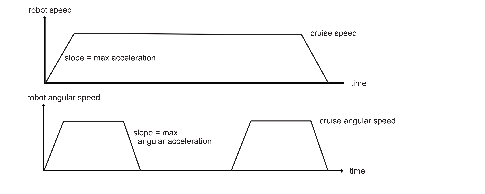

# MotorController v2
firmware of the dedicated motion processor.

## Goals

The motion processor is required to :
* keep track of the current absolute position and heading of the robot
* provide an high level interface to accurately control the motion of the robot

The robot should be able to go to any goal position and heading using a trajectory composed of two arcs and a straight line.
Here is an example :

Because the robot is not capable of infinite linear nor angular acceleration, maximum accelerations should be defined and
the speed profiles should look like (for example) :

Given the intricate relation between motion and high level considerations, the computation of the trajectory won't be performed by the
motion coprocessor. It will receive position control commands :
* maximum linear and angular accelerations
* linear and angular cruise speeds
* goal mean distance (mean distance being the mean between the distance of the two wheels)
* goal heading, and eventually a reference mean distance to start the rotation. This should allow for a precise synchronization between
translation and rotation.

This way of controlling motion provide a flexible interface without overloading the I2C bus through which the commands are transmitted,
nor requiring any real time capabilities from the master.

The MotionController will provide a **position control**, so that the robot is either moving toward its goal or
holding its current position.

The real position should also be tracked, using a fusion of the data from the encoder wheels, the IMU and radio measurements.
A special attention should be given to the IMU response time. Indeed when rotating, it is suspected that the heading measurement lags.

## Interface

The MotionController should provide read/write data to the I2C master mapped as 8 or 16 bits registers :

* current x absolute position (read)
* current y absolute position (read)
* current heading (read/write)

 

* current right wheel distance (read/write)
* current left wheel distance (read/write)

 

* maximum accelaration (read/write)
* maximum angular accelaration (read/write)
* cruise speed (read/write)
* cruise angular speed (read/write)
* goal mean distance (read/write)
* goal heading (read/write)
* heading distance sync reference (read/write) 

 

* linear PID coefficients (read/write, flash stored)
* angular PID coefficients (read/write, flash stored)

Any distance is in mm.
Angle range is [0, 360].

## "Registers" address and size

The motorboard listens on address 0x12 (device address).

Configuration values are placed first, then data and finally targets.
All write-only values are read-as-zero (RAZ).
Writing to a read-only value is implementation-defined, it will defined later.
For 32 bits value, split into 2 16-bit register, the LOW register must always be
read/written first. Failing to follow this rule will lead to invalid data.

|Name|Address|Access|Size (in bits)|
|----|-------|------|--------------|
|wheels_gap (in mm)|0x00|R/W|16|
|ticks_per_m|0x02|R/W|16|
|angular_trust_threshold [absolute value] (in °.s-1)|0x04|R/W|16|
|max_linear_acceleration (in mm.s-2)|0x06|R/W|16|
|max_angular_acceleration (in °.s-2)|0x08|R/W|16|
|cruise_linear_speed(in mm.s-1)|0x0A|R/W|16|
|cruise_angular_speed(in °.s-1)|0x0C|R/W|16|
|linear p coefficient|0x0E|R/W|16|
|linear i coefficient|0x10|R/W|16|
|linear d coefficient|0x12|R/W|16|
|angular p coefficient|0x14|R/W|16|
|angular i coefficient|0x16|R/W|16|
|angular d coefficient|0x18|R/W|16|
|motor left forward sense|0x1A|R/W|8|
|motor right forward sense|0x1B|R/W|8|
|coding wheel left initial ticks low|0x1C|R/W|16|
|coding wheel left initial ticks high|0x1E|R/W|16|
|coding wheel right initial ticks low|0x20|R/W|16|
|coding wheel right initial ticks high|0x22|R/W|16|
|coding wheel left orientation|0x24|R/W|8|
|coding wheel right orientation|0x25|R/W|8|
|linear allowance (in mm) Low|0x26|R/W|16|
|linear allowance (in mm) High|0x28|R/W|16|
|angular allowance (in °)|0x2A|R/W|16|
|store config data in flash|0x30|W|8|
|reserved|0x31-0x7F|||
|current x absolute position Low|0x80|R/W|16|
|current x absolute position High|0x82|R/W|16|
|current y absolute position Low|0x84|R/W|16|
|current y absolute position High|0x86|R/W|16|
|current right wheel distance Low|0x88|R/W|16|
|current right wheel distance High|0x8A|R/W|16|
|current left wheel distance Low|0x8C|R/W|16|
|current left wheel distance High|0x8E|R/W|16|
|current heading|0x90|R/W|16|
|current mean distance (in mm) Low|0x92|R|16|
|current mean distance (in mm) High|0x94|R|16|
|goal mean distance (in mm) Low|0xA0|W|16|
|goal mean distance (in mm) High|0xA2|W|16|
|goal heading (in °)|0xA4|W|16|
|heading distance sync reference (in mm)|0xA6|W|16|
|master stop for motors|0xA8|R/W|8|
|translation ended|0xA9|R|8|
|rotation ended|0xAA|R|8|
